# Bringing AI to Java

JUG Workshop

by Andras Fejes


---

## Sources

<style>
  .row {
  display: flex;
  justify-content: left;
  gap: 30px;
  margin: 60px 0;
}
</style>
<div class="row">
  
  <a href="https://github.com/fejesa/quarkus-ai-mcp">https://github.com/fejesa/quarkus-ai-mcp</a>
</div>

<div class="row">
  
  <a href="https://github.com/fejesa/quarkus-ai-mcp-workshop">https://github.com/fejesa/quarkus-ai-mcp-workshop</a>
</div>

---

## GenAI Integration


---

## Used Tech Stack


* Frontend: [Angular](https://angular.dev) + [NodeJS](https://nodejs.org)
* Backend + AI Service: [Quarkus](https://quarkus.io) + [Langchain4J](https://docs.langchain4j.dev/)
* LLM: [Ollama](https://ollama.com/)
* Dev & Test: Docker & Testcontainers

---

## Why use Quarkus for AI-Infused Applications

Quarkus is ideal for AI applications due to its

* performance, agility, and developer experience; offers native Generative AI integration via LangChain4j, supporting declarative AI services, various LLMs, and advanced prompt engineering.

Quarkus's "AI-Enhanced Developer Experience" provides

* fast startups, low memory, and a reactive core for cloud-native AI; boosts developer velocity with live coding, a unified Java stack, and robust observability/security for reliable AI services.

---

## Application Architecture

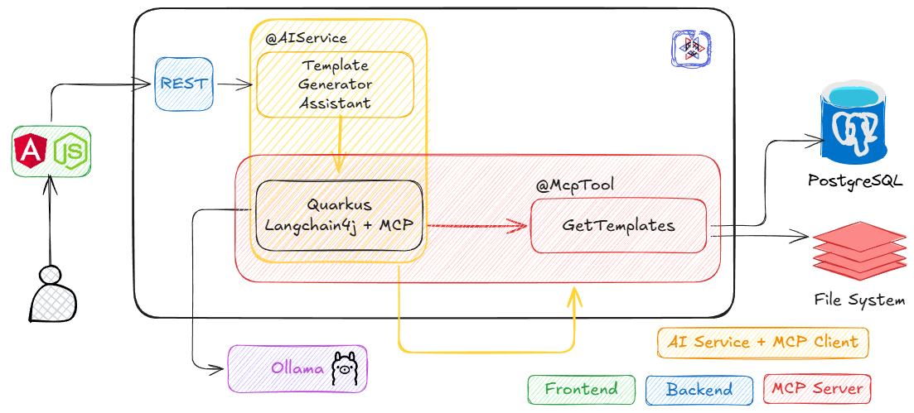

---

## Application Project Structure

```txt
├── docs
├── resources
│   └── templates
└── src
    ├── main
    │   ├── java
    │   ├── resources
    │   └── webui
    └── test
        └── java
```

---

## Message Template Generator - Frontend

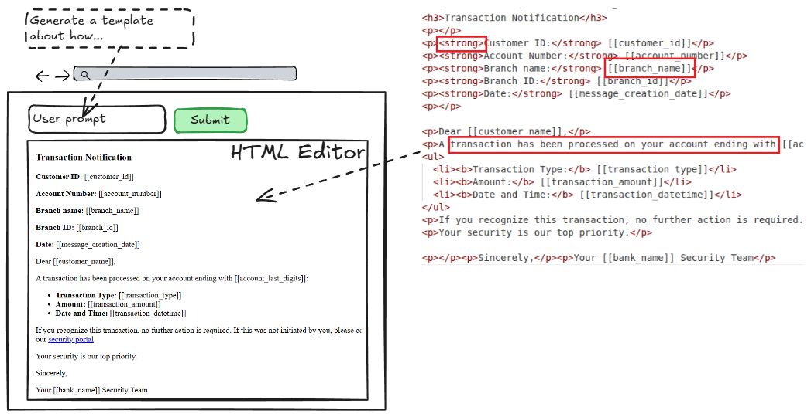

---

## Message Template Generator - Langchain4j

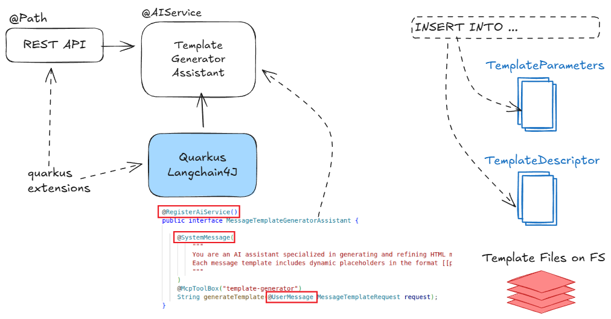

---

## Langchain4j Continue

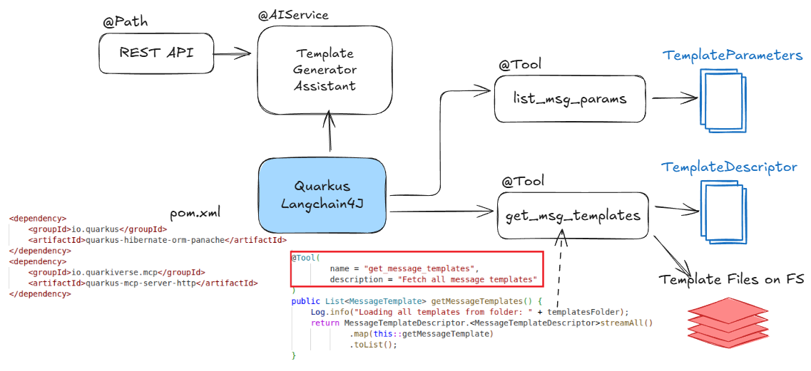

---

## How to access REST API - Step 1

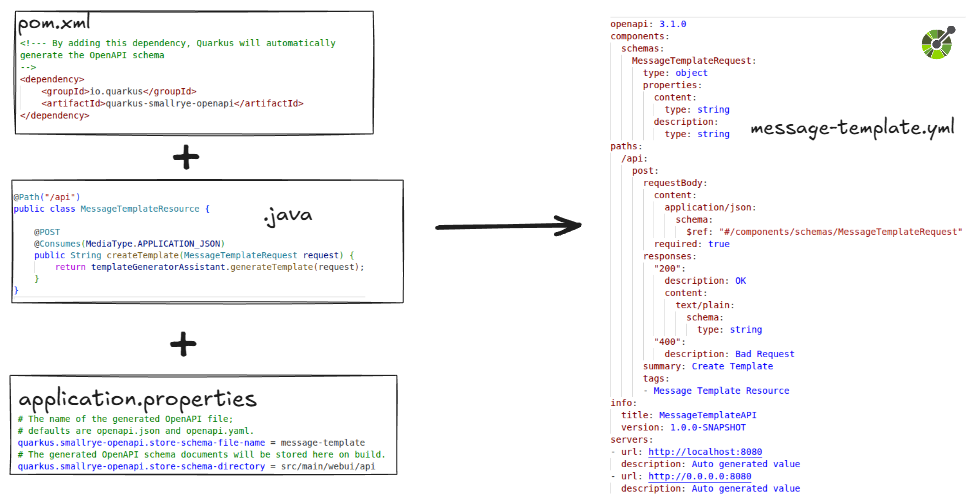

---

## How to access REST API - Step 2

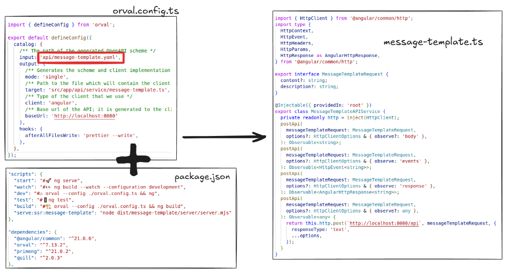

---

## Quarkus Quinoa Build

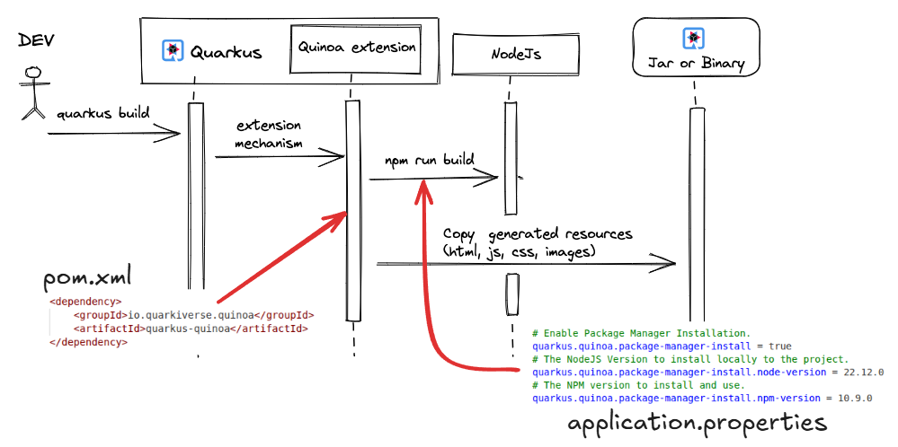

---

## Ollama Architecture

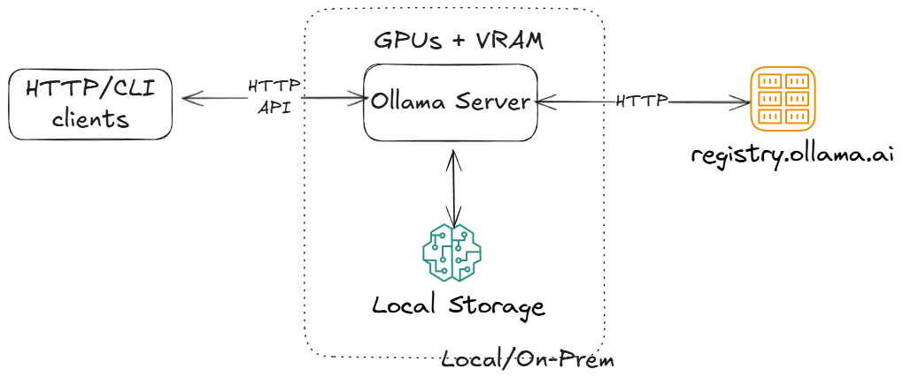

---

## Ollama API - https://docs.ollama.com/api

```txt
Base URL: http://localhost:11434/api
```

<div style="margin-bottom:8px">
  <div style="display:inline-flex;align-items:center;gap:20px;font-family:system-ui;font-size:20px;">
    <span style="background:#2563eb;color:white;padding:2px 8px;border-radius:9999px;font-weight:600;font-size:20px;">POST</span>
    <span>/api/generate</span>
    <span>Generates a response for the provided prompt.</span>
  </div>
</div>
<div style="margin-bottom:8px">
  <div style="display:inline-flex;align-items:center;gap:20px;font-family:system-ui;font-size:20px;">
    <span style="background:#2563eb;color:white;padding:2px 8px;border-radius:9999px;font-weight:600;font-size:20px;">POST</span>
    <span>/api/chat</span>
    <span>Generate the next chat message in a conversation between a user and an assistant.</span>
  </div>
</div>
<div style="margin-bottom:8px">
  <div style="display:inline-flex;align-items:center;gap:20px;font-family:system-ui;font-size:20px;">
    <span style="background:#059669;color:white;padding:2px 8px;border-radius:9999px;font-weight:600;font-size:20px;">GET</span>
    <span>/api/tags</span>
    <span>Fetch a list of models and their details.</span>
  </div>
</div>
<div style="margin-bottom:8px">
  <div style="display:inline-flex;align-items:center;gap:20px;font-family:system-ui;font-size:20px;">
    <span style="background:#059669;color:white;padding:2px 8px;border-radius:9999px;font-weight:600;font-size:20px;">GET</span>
    <span>/api/ps</span>
    <span>Retrieve a list of models that are currently running.</span>
  </div>
</div>
<div style="margin-bottom:8px">
  <div style="display:inline-flex;align-items:center;gap:20px;font-family:system-ui;font-size:20px;">
    <span style="background:#2563eb;color:white;padding:2px 8px;border-radius:9999px;font-weight:600;font-size:20px;">POST</span>
    <span>/api/show</span>
    <span>Show model details.</span>
  </div>
</div>
<div style="margin-bottom:8px">
  <div style="display:inline-flex;align-items:center;gap:20px;font-family:system-ui;font-size:20px;">
    <span style="background:red;color:white;padding:2px 8px;border-radius:9999px;font-weight:600;font-size:20px;">DELETE</span>
    <span>/api/delete</span>
    <span>Delete a model.</span>
  </div>
</div>

---

## Model Context Protocol - MCP

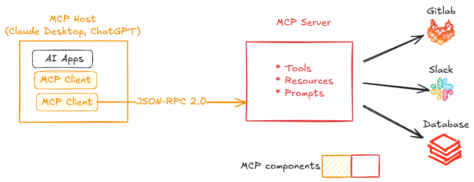

---

## MCP Connection Lifecycle

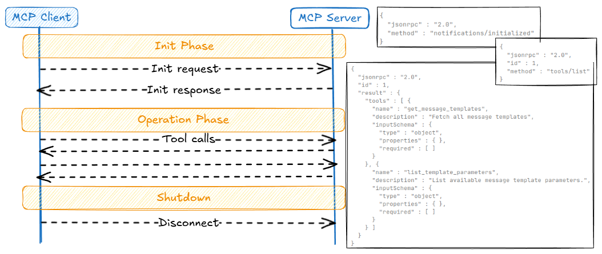

---

## Putting All Together

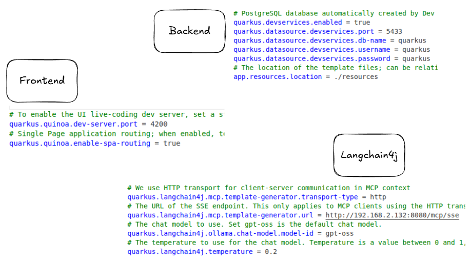

---

## MCP Calls Flow

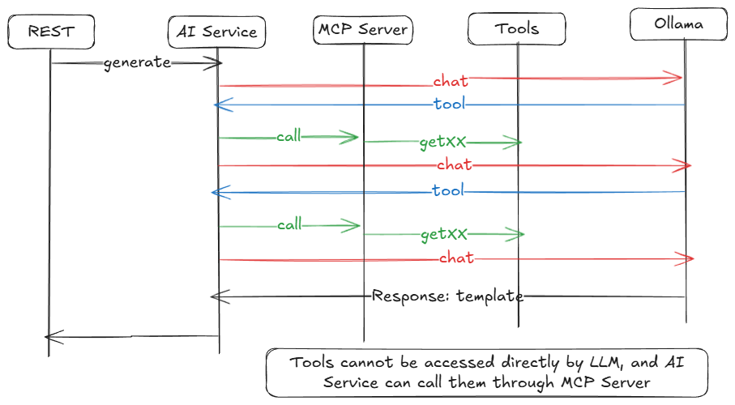

---

## Putting All Together Continue

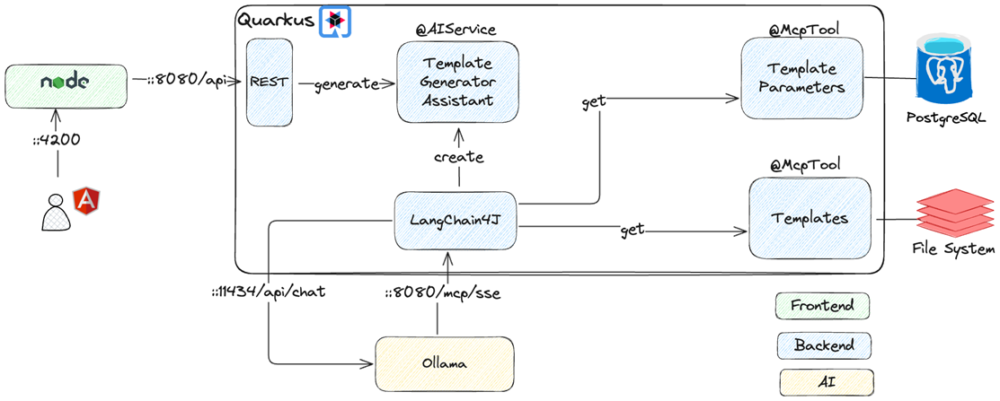

---

## Demo

* Build and run application
* mcpinspector
* Run tests

---

## Observability

OpenTelemetry is to collect, process, and export signals.

* Metrics: A measurement captured at runtime (for example Grafana)
* Logs: A recording of an event (for example Elastic)
* Traces: The path of a request through your application (for example Langfuse)
