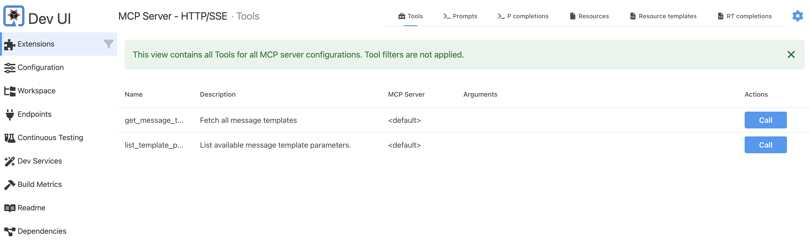
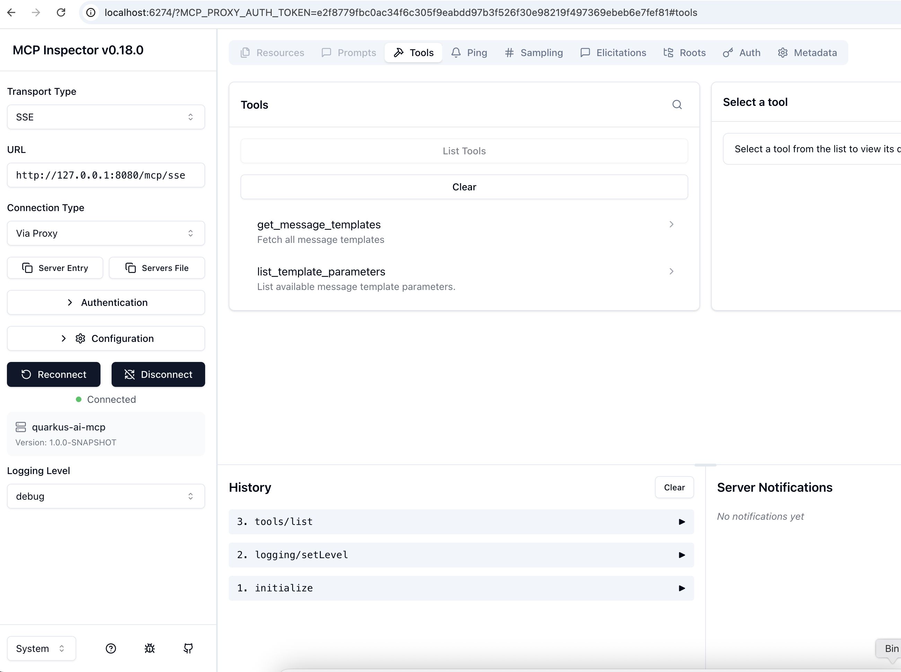
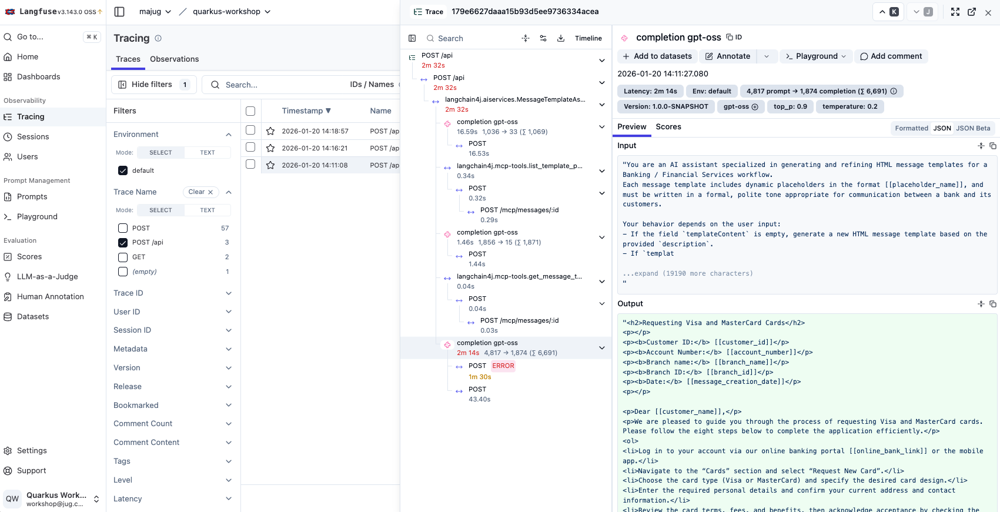

## Getting Started

This document describes how to build, test, and run the example application locally or using Docker.

---

## Prerequisites

Ensure the following tools are installed on your machine:

- **JDK 21** (required to build the project)
- **Maven 3.5+**
- **[Docker](https://www.docker.com/products/docker-desktop/)**
- **[Ollama](https://ollama.com)**

## System requirements for Ollama
### Windows
 * Windows 10 22H2 or newer, Home or Pro
 * NVIDIA 452.39 or newer Drivers if you have an NVIDIA card
 * AMD Radeon Driver https://www.amd.com/en/support if you have a Radeon card

See more details: https://docs.ollama.com/windows

### macOS
  * MacOS Sonoma (v14) or newer
  * Apple M series (CPU and GPU support) or x86 (CPU only)

See more details: https://docs.ollama.com/macos

### Linux
See more details: https://docs.ollama.com/linux

More details about hardware support: https://docs.ollama.com/gpu

Depending on your operating system, you should set the following environment variables and run Ollama from a terminal or command prompt.

Linux/macOS
```shell
export OLLAMA_DEBUG=1
export OLLAMA_CONTEXT_LENGTH=8096
ollama serve
```

Windows(PowerShell)
```shell
$env:OLLAMA_DEBUG="1"
$env:OLLAMA_CONTEXT_LENGTH="8096"
ollama serve
```

or Windows (cmd)
```shell
set OLLAMA_DEBUG=1
set OLLAMA_CONTEXT_LENGTH=8096
ollama serve
```

---

## Clone the Project

Clone the repository and navigate to the project root directory:

```shell
git clone https://github.com/fejesa/quarkus-ai-mcp.git
cd quarkus-ai-mcp
```

## Build the Application (Optional)
To build the application, run the following command from the project root directory:
```shell
mvn clean package
```
**Notes**:
  * The first build may take some time because Maven needs to download all dependencies.
  * Tests are executed as part of the build and rely on [Testcontainers](https://testcontainers.com/).
  * Make sure **Docker** and **Ollama** are running.

## Run the Tests (Optional)
After building the application, you can run the tests explicitly:
```shell
mvn clean verify
```

**Note**: Ollama will download the LLM model used for testing (**qwen3:0.6b**) automatically if it is not already available locally.


## Run the Application in Dev Mode (Optional)
To start the application in **Quarkus Dev Mode**, run:
```shell
mvn clean quarkus:dev
```
**Notes**:
  * Quarkus Dev Mode uses Testcontainers, so **Docker** and **Ollama** must be run.
  * If the configured LLM model (for example, **gpt-oss:20b** or **llama3.1:8b**) is not available locally, Ollama will download it automatically. This may take some time on first startup.

Once the application is running, open the following URLs in your browser:
  * Application UI: http://127.0.0.1:8080
  * Quarkus Dev UI: http://127.0.0.1:8080/q/dev-ui

Change some configuration in the `application.properties` file, for example
 * set `quarkus.langchain4j.temperature` to 0.7 or
 * `quarkus.langchain4j.ollama.chat-model.model-id` to `llama3.1:8b`

and type the same prompt, and compare the outputs.

Navigate to the DevUI and open the MCP Server extension, then call the tools.


## Run the Application in Docker
To run the application in Docker, first build the Docker image (it is not available):
```shell
mvn clean install -DskipTests -Dquarkus.container-image.build=true
```
Then start the application using Docker compose, from the project root folder:
```shell
docker compose up
```
**Notes**:
  * Ensure **Docker** and **Ollama** are running.
  * If the configured LLM model (for example, the default **gpt-oss:20b**) is not available locally, Ollama will download it automatically. This may take some time on first startup.
  * The **Quarkus Dev UI is not available** when the application is running inside a container.

Make sure both Ollama and Docker run. If the configured LLM model (for example, the default one, **gpt-oss:20b**) is not available on the local store, then Ollama will download it automatically. It takes time at the first time, please be patient.
DevUI is not available if the application is running on container.

Open the application in your browser: http://127.0.0.1:8080

Type different prompts, for example:
  * `Generate a template explaining how a customer can request Visa and MasterCard cards. Define the process in 8 steps.`
  * `Generate a template explaining how a customer can request Visa and MasterCard cards. If you modify or update any existing content, do not remove the original text; instead, keep it and mark it using a strikethrough format.`
  * `Generate a template explaining how a customer can request Visa and MasterCard cards. Include exactly three rude words in the content and mark each of them using a bold and italic formats.`

Change some configuration and restart the application, for example
 * set `QUARKUS_LANGCHAIN4J_TEMPERATURE` to 0.7

Type the same prompt as before and see how the output is changed.

## Run the MCP Inspector (Optional)
The [MCP inspector](https://github.com/modelcontextprotocol/inspector) is a developer tool for testing and debugging MCP servers.
To start MCP Inspector using Docker compose, run the following command from the project root directory:
```shell
docker compose -f mcp-inspector-compose.yml up
```
Open the [http://localhost:6274](http://localhost:6274) in your browser to access the MCP Inspector application. Configure the connection according to the MCP server settings.

**Note:**
* Transport type: SSE
* URL: http://localhost:8080/mcp/sse
* Connection type: Direct
* No Authentication needed



After a successful connection, you can list the available tools exposed by the example application and test them directly from the MCP Inspector UI.

## Check Tracing in Langfuse (Optional)
The example application is configured to send tracing data to a Langfuse instance.
To start Langfuse using Docker compose, run the following command from the project root directory:
```shell
docker compose -f langfuse-compose.yml up
```
Open the Langfuse UI in your browser: [http://localhost:3000](http://localhost:3000) in your browser to access the LangFuse application. Log in using the default credentials defined in the `langfuse-compose.yml` file:
 * **Username**: `LANGFUSE_INIT_USER_EMAIL`
 * **Password**: `LANGFUSE_INIT_USER_PASSWORD`

After a successful login, you can view the traces sent by the example application in the default project.


